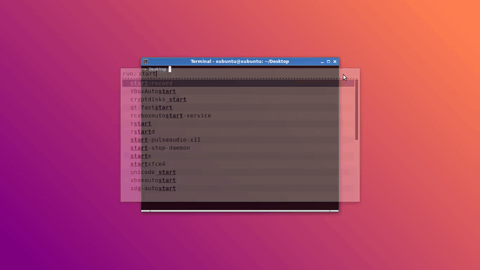

# Bash bookmark

## Description

Script for storing working directory like pushd and popd command



## Usage

```
  NAME
        b - bookmark management
        c - change diretory to a bookmark

  USAGE
        b [option] [index | string]
        c [index | string]

        You need source this script before use command b and c.
        Run this command to source this script:

        echo "source $(pwd)/bookmark.sh" >> ~/.bashrc

        You can change bookmark file location by edit BM_FILE variable in this script

  OPTIONS
        f [file path]           Overwrite bookmark file
        a [diretory path]       Add diretory to list bookmarks
                                Without any diretory path will auto get current diretory
        l                       List bookmark file with index
        i [index]               Get a bookmark by index
        g [string]              Get bookmark which match string
        o [index | string]      Get a bookmark by index or match string
                                If match many bookmark, auto get first one.
        r [index]               Remove a bookmark by index

  EXAMPLES
        b a /media/cdrom        Add a diretory to bookmark
        b l                     Print list bookmarks
        b                       Shorthand command to print list bookmarks
        b i 1                   Get first bookmark
        b 1                     Shorthand command to get first bookmark
        b g cdrom               Get bookmark which contain string "cdrom"
        b cdrom                 Shorthand command to get bookmark which contain string "cdrom"
        b media.*cdrom          Get bookmark which have both "media" and "cdrom" string.
        c 1                     Change diretory to first bookmark
        c cdrom                 Change diretory to bookmark match "cdrom" string
```
